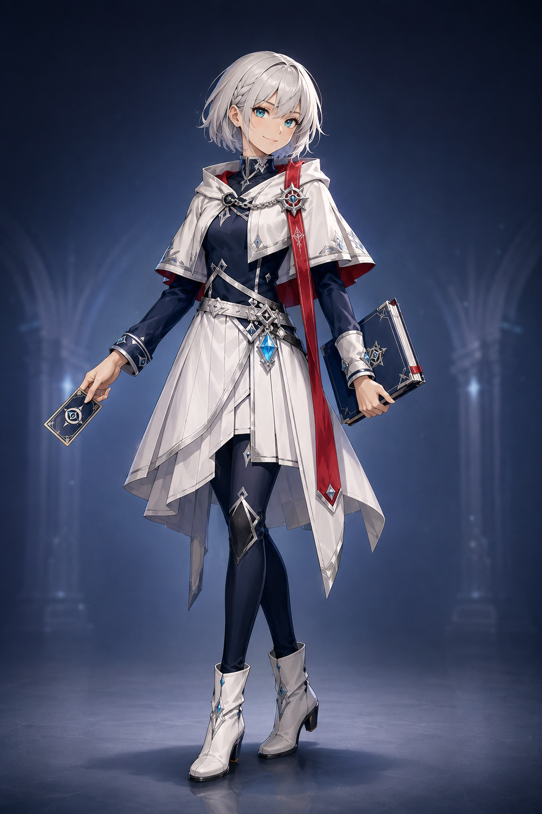
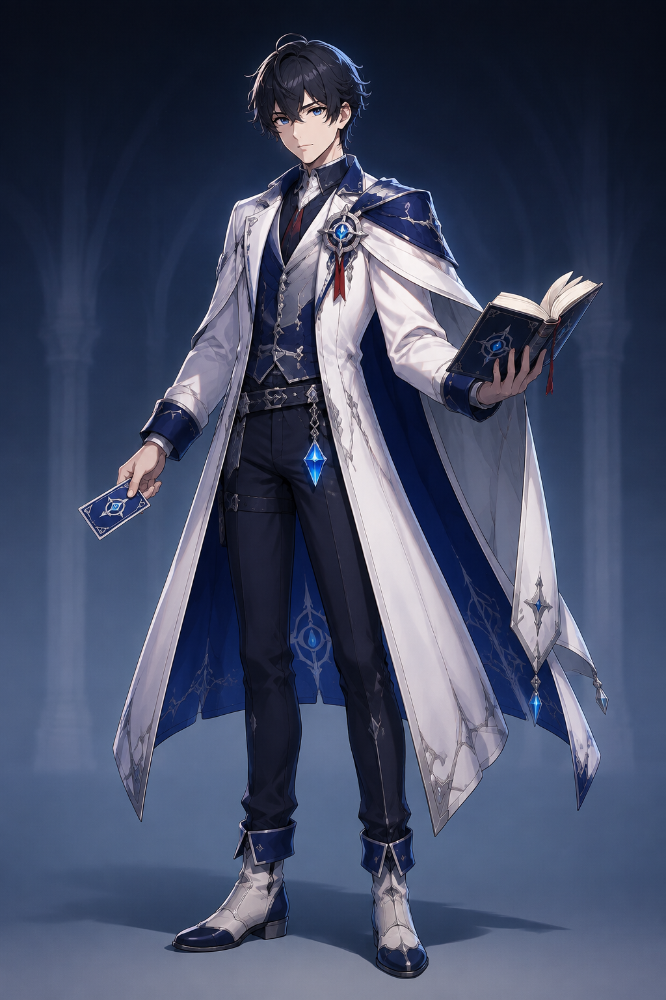
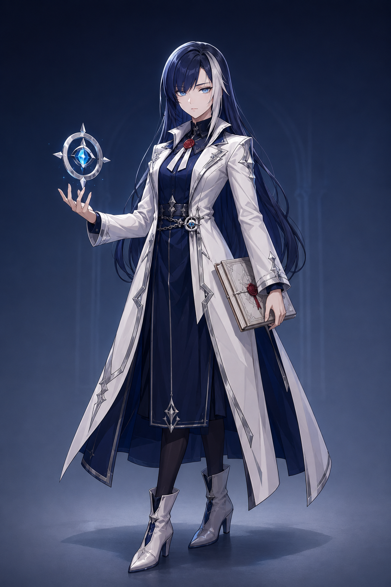
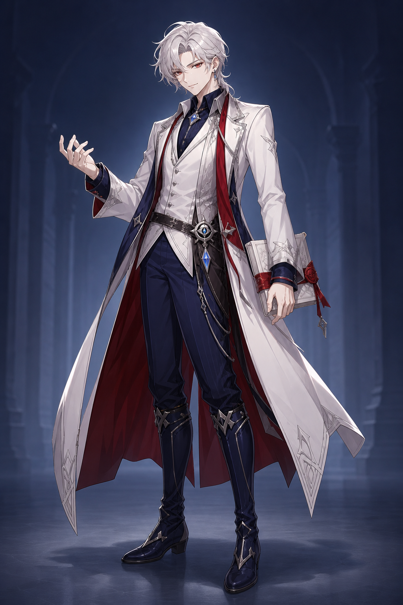
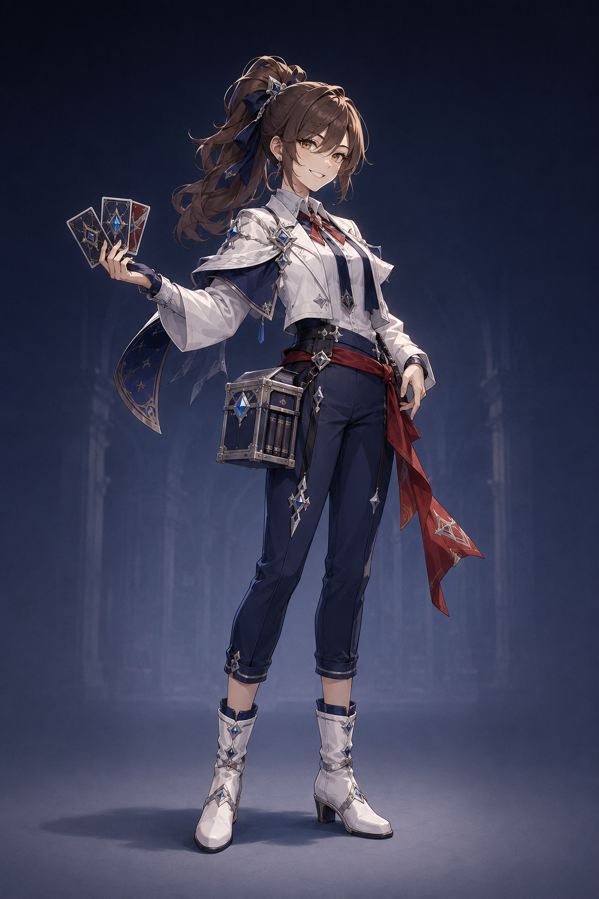
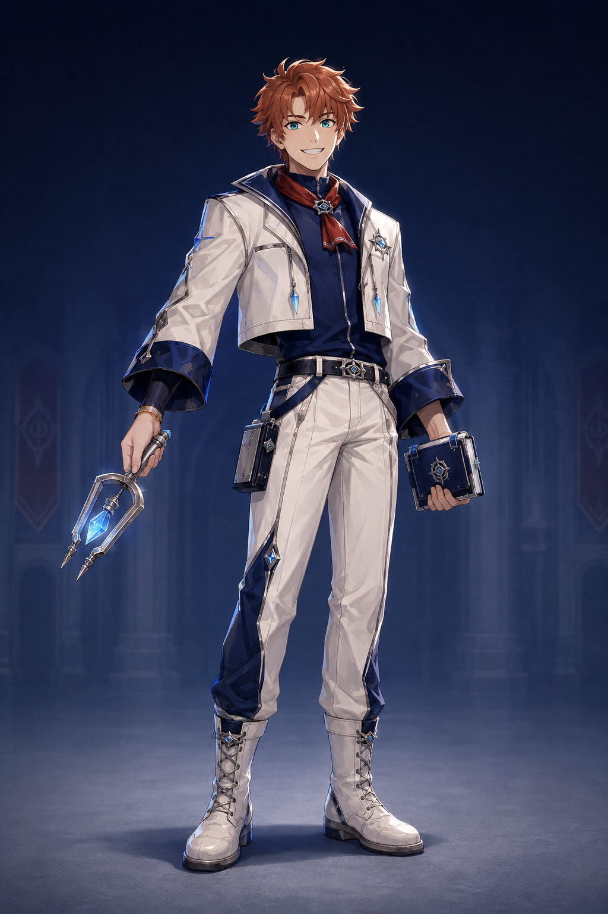

> **注意（2026-09-07）**: 本フォルダは旧世界観（万史大書庫／対読／記録収集家）で生成した記録。用語は廃止済みで、正典は [docs/world-bible.md](../../world-bible.md)。画像は参照資料として保持する。

# LORE — 書庫の対読者：女性3案・男性3案

2026-09-07 / キャラクター案の比較用。全6枚、1案1画像。肩書き・性格は提案段階であり、確定設定ではない。

承認された「万史大書庫の対読」KVを参照し、白銀・紺・シアンと赤い差し色を共通化。原神・崩壊スターレイルを参考にしたアニメRPG風のオリジナルデザイン。髪型・衣装の輪郭・小道具で区別する。

## 比較

| 方向 | 女の子 | 男の子 |
|---|---|---|
| 対読の主人公 | [女の子① 赤い栞の記録士](f01-crimson-bookmark.png)  | [男の子① 蒼の対読士](m01-cobalt-tactician.png)  |
| 封印と歴史 | [女の子② 第零書庫の封印官](f02-zero-archive-keeper.png)  | [男の子② 紅の封緘士](m02-crimson-seal-curator.png)  |
| 取引と技巧 | [女の子③ 回覧車の交渉人](f03-circulation-dealer.png)  | [男の子③ アチューンの調律師](m03-attune-maintainer.png)  |

## 各案の狙い

- **女の子① 赤い栞の記録士** — 明快で親しみやすい主人公候補。短い白銀髪、赤い栞リボン、短いケープ。
- **女の子② 第零書庫の封印官** — 静かで凛とした上級司書。長い紺髪と直線的な白いロングコート。
- **女の子③ 回覧車の交渉人** — 快活で駆け引き上手。栗色の高いポニーテール、軽装、カードケース。
- **男の子① 蒼の対読士** — 採用KVの青側を発展。黒紺髪、白い肩掛け、落ち着いた戦略家。
- **男の子② 紅の封緘士** — 採用KVの赤側を発展。白銀髪、深紅の裏地、余裕のある好敵手。
- **男の子③ アチューンの調律師** — 親しみやすい技巧派。赤茶の短髪、短い白ジャケット、結晶の調律道具。

最初の対になる二人としては **女性① × 男性①** が候補。銀髪と黒紺髪、赤と青、親しみやすさと落ち着きが対照になり、承認KVの関係性を引き継ぎやすい。ミステリアスに寄せるなら女性② × 男性②、快活なコンビなら女性③ × 男性③。いずれも選定前の提案。

## アニメーションについて

[リーダー演出の実現方法・8状態の仕様・既存コードへの接続検討](leader-animation-study.md)

今回の画像は背景込みのコンセプトPNGで、パーツ分けPSD・リグ・モーションは含まない。全身の衣装確認用であり、実際の対戦用には選んだ二人を着席した上半身の基準ポーズとして制作する案を推奨する。

## 生成・保存

Codex内蔵ImageGenを6回使用。入力は承認済みKVと現行ロゴ。プロンプト全文・生成元は [prompts.json](prompts.json)。原本を保持して、このフォルダへ複製した。PNGのサイズ・構造・ハッシュは [manifest.json](manifest.json) に記録。

目視確認: 全6枚で全身が収まり、髪型・シルエット・小道具が判別可能。白銀と紺、結晶と書物の世界観が共通。男性①は指示より長いケープとなったが、男女各3案の差異と対読士の方向性は成立している。小さな飾りや髪束は、採用後のリグ制作時に整理する。

本番のキャラクター採用・アニメーション実装・既存アセットの置き換えは行っていない。

