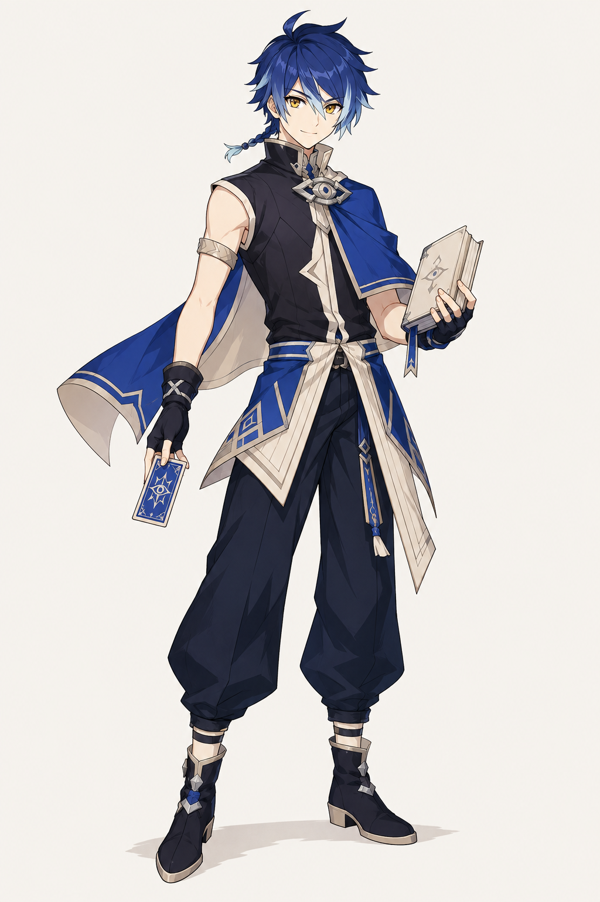
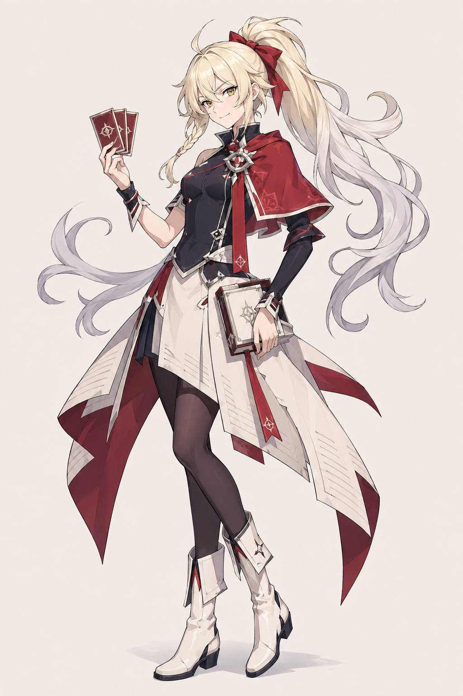
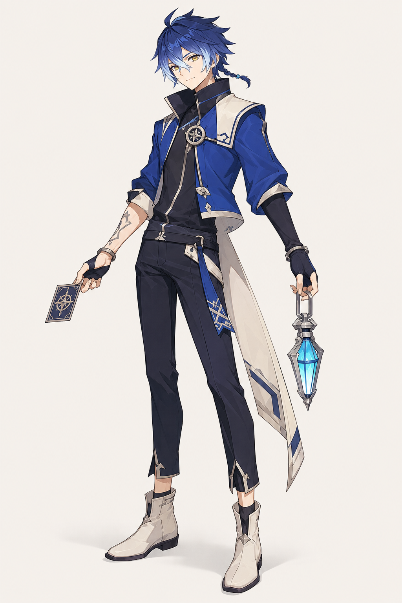
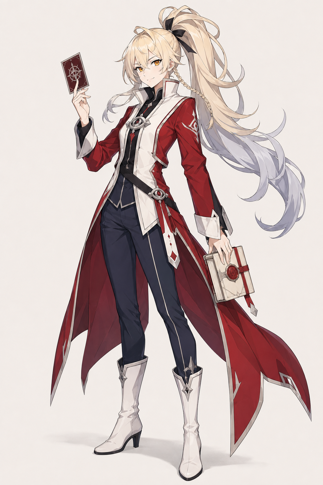
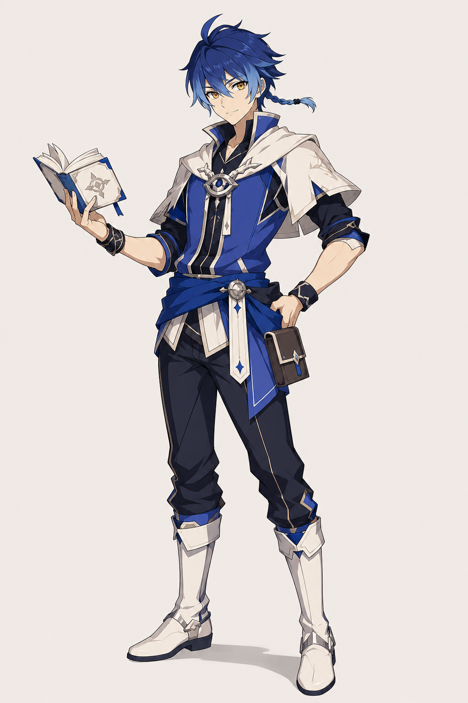
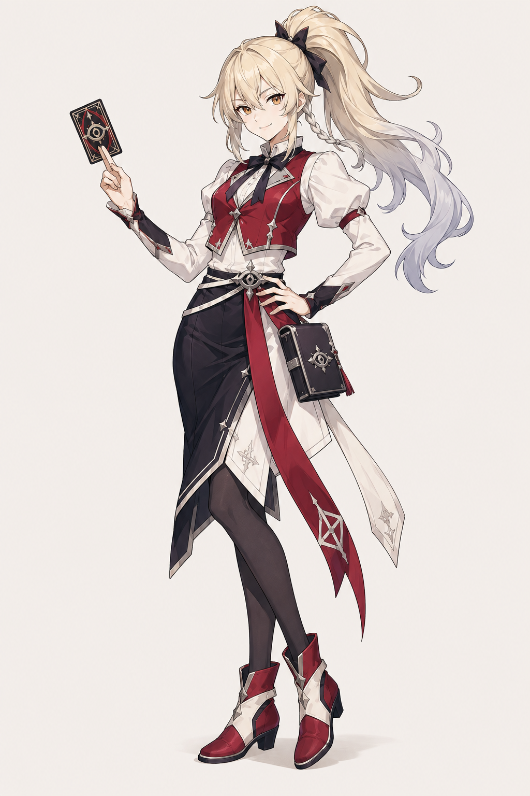

> **注意（2026-09-07）**: 本フォルダは旧世界観（万史大書庫／対読／記録収集家）で生成した記録。用語は廃止済みで、正典は [docs/world-bible.md](../../world-bible.md)。画像は参照資料として保持する。

# LORE — 青の男の子・赤の女の子：各3案

> 選定済み（2026-09-07）: 女の子①と男の子②をユーザーがFix。[確定原画](../../characters/README.md) を今後の外見基準とする。

2026-09-07。ユーザーの添付4画像を参照して制作した第2セット。**2キャラクター × 3デザイン案 = 6枚**。同一キャラクターの顔・髪色を共通化し、衣装の形を変えて比較する。

男の子は添付1・2、女の子は添付3・4を組み合わせる指示。衣装はLOREの年代記・栞・読書灯・目と環の意匠へ再構成した。前回の光沢・細かい銀装飾を抑え、輪郭線と整理されたセル影、大きな色面を優先した。

## 比較

| 案 | 青の男の子 | 赤の女の子 |
|---|---|---|
| 1 | [青の男の子① 頁のショートケープ](m01-blue-page-cape.png)  | [赤の女の子① 紅い栞の対読士](f01-red-bookmark-cape.png)  |
| 2 | [青の男の子② 読書灯の対読士](m02-blue-lantern-reader.png)  | [赤の女の子② 紅封の書庫番](f02-red-seal-tailcoat.png)  |
| 3 | [青の男の子③ 年代記の軽装](m03-blue-chronicle-vest.png)  | [赤の女の子③ 回覧のリボン](f03-red-circulation-ribbons.png)  |

## デザインの違い

- **青の男の子① 頁のショートケープ** — 軽快な主人公寄り。青い短いケープと頁形の裾。
- **青の男の子② 読書灯の対読士** — クールな方向。高い襟、短い青ジャケット、小さな読書灯。
- **青の男の子③ 年代記の軽装** — 親しみやすい技巧派。青いベストと短い白い肩掛け。
- **赤の女の子① 紅い栞の対読士** — 快活な主人公寄り。赤い短ケープと白い頁形スカート。
- **赤の女の子② 紅封の書庫番** — 凛とした好敵手寄り。深紅の燕尾と白い前身頃。
- **赤の女の子③ 回覧のリボン** — いたずらっぽい技巧派。赤いベストと軽い非対称シルエット。

顔と髪の方向性を共通にした比較用の案であり、表情・パーツまで完全一致する最終設定画ではない。選定後に線・紋章・髪束の一貫性を整える。

## 制作記録

- Codex内蔵ImageGenを6回使用。1案1画像、全身が見える縦長。
- 添付4画像は会話の参照画像として渡した。表示されていた一時ファイルパスでは画像ファイルが見つからなかったため、num_last_images_to_include=4を使用。各プロンプトで参照ペアと役割を指定した。
- [プロンプト全文・生成元](prompts.json)、[寸法・SHA-256](manifest.json)。
- 全6枚をこのフォルダへ原寸で複製し、生成元を保持。
- 目視で男の子の青、女の子の赤、衣装の違い、全身の収まり、書物・カードのモチーフを確認。PNGは背景込みのコンセプト画。

## 動作の方針変更

[固定アニメーションを再生する構成](animation-playback.md)へ簡素化。Idleはループ、各アクションは一度再生してIdleへ戻す。Live2Dや目・髪の実時間個別制御は今回の必須要件から外す。今回生成したのは静止画6枚であり、動く素材と本番への組み込みは未制作。
