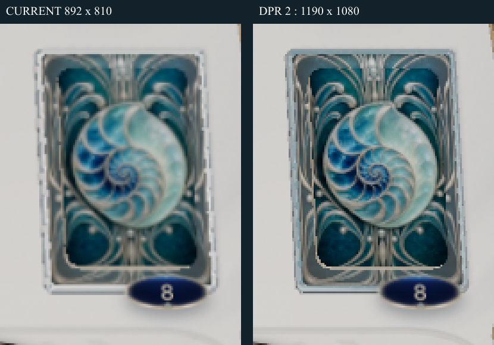
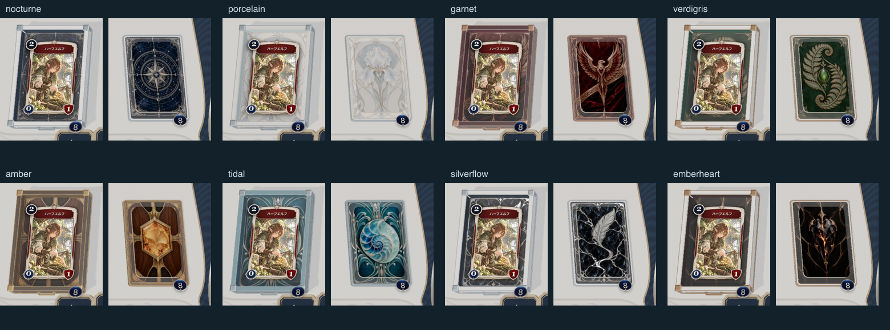

# コスメティック品質監査 — 解像度と装着価値

2026-10-02。対象は `codex/cosmetics-eight-sets`、比較前コミット `c6fc9c34` の8セットと厚みプレビュー。ステージングや現在のmainの監査ではない。

## 結論

**厚みだけを変える方針では解決しない。描画密度の不足は実在する。同時に、印刷された絵の差を、装備の素材・造形・使用体験の差へ変換できていない。現状を「高品質な新装備として完成」と判定しない。**

前回は画像の寸法・正常表示・演出関数の動作を確認したが、それを実寸での鑑賞品質や装着価値の検証として十分に扱ってしまった。特にスリーブ表面の反射、デフォルト家具から失った素材情報、カードに隠れる意匠、移動中の素材表現の途切れを見落としていた。

[解像度の原因を分離する比較ページ](http://127.0.0.1:5336/cosmetic-studio.html?audit=1&set=tidal)。画像・形状・厚み・枚数・カメラを固定し、盤面／購入用の描画密度だけを切り替える。通常対戦の品質設定は変更していない。厚みは1倍、束は8枚。

## 1. 実測した解像度

ユーザーが開いていたIABを調査した時点では、外側644×674 CSS px、DPR 2、盤面iframe約595×540 CSS px。盤面キャンバスは892×810 px。自分のデッキ置き場の投影領域は約51.6×68.1 CSS pxだった。これは家具を含む領域で、スリーブ単体の幅ではない。

同じ条件を独立したブラウザテストでも再現した。

| 盤面の表示サイズ | 現行の内部解像度 | DPR 2の検証側 | 現行／検証の画素数 |
|---|---:|---:|---:|
| 595×540 | 892×810 | 1190×1080 | 約56% |
| 1280×720 | 1920×1080 | 2560×1440 | 56.25% |
| 1920×1080 | 2149×1209 | 3840×2160 | 約31% |

現行は `min(devicePixelRatio, 1.5, sqrt(2,600,000 / 表示面積))`。高密度ディスプレイでは最初から不足し、大きい盤面では260万画素の上限によって倍率がさらに下がる。HTMLの文字やカード面と、WebGLの家具のシャープさも揃わない。

左が現行、右が検証側。同じ595×540表示のスクリーンショットから同じ領域を切り出し、どちらも最近傍で3倍に拡大した。高解像度の原画を直接貼った比較ではない。縁・螺旋・家具の細線は改善するが、立体の素材や構図は変わらない。元の盤面全体は `qa/raster-current.png` と `qa/raster-native.png`。

描画密度と表示サイズの関係、画素数増加による負荷は [Three.js公式説明](https://threejs.org/manual/pages/responsive.html) でも確認できる。本監査はFPS向上／悪化率を測ったものではない。GPUを使う別作業が同時に動いていたため、端末性能の比較値は採用しない。DPR 2の全画面適用は最大約3.2倍の画素数になり、無条件の本採用は勧めない。

## 2. 問題の一覧と優先順位

「事実」はソース・実測・画像による確認、「評価」は制作側の判断。「P0」は今回の刷新の品質を成立させる前提であり、セキュリティ障害の意味ではない。

| ID | 優先 | 確認した事実 | 品質への影響・評価 | 対応方針 |
|---|---|---|---|---|
| Q01 | P0 | 1.5倍／260万画素で描画を制限 | 高密度画面で縁・細部がぼける。厚みでは直らない | 静止キャッシュと局所描画を保ち、装備の解像度予算を見直す。全画面2倍は比較用から性能検証へ |
| Q02 | P0 | 現パネルでデッキ家具全体が約52px幅 | 数十pxへ密集した装飾を押し込み、主題が読めない。大きな原画だけで合格にできない | 48〜64pxで主役の形を先に成立させ、細密模様は二次情報にする |
| Q03 | P0 | `pileModels.ts` の表裏は `MeshBasicMaterial`、環境マップも未設定 | 箔・硝子・金属・布の反射差がなく、明暗を描いた印刷物に留まる | スリーブ専用の反射／粗さ／凹凸マスク。絵柄の読める暗部を残す。文字面は別扱い |
| Q04 | P0 | 元のGLBには本体・布面のnormalとmetallicRoughness textureがある。新素材はroughnessMapを引き継がず、normalMapは木の本体以外でnull | デフォルトより素材情報を落としている。色は変わるが手触りが弱い | テーマ別の粗さ・法線を制作。原画の明暗をそのまま法線にする処理は避ける |
| Q05 | P1 | 8セットとも同じデッキ・シェルフのGLB | シルエット、縁の厚さ、角、金具配置が同じ。家具を交換した実感が弱い | カード位置を固定したまま外装の面分割・縁・金具・透明層などを差別化 |
| Q06 | P1 | 家具の中央にスリーブと同じ画像を使用 | 一番見せたい中央モチーフがカードに隠れる。特にシェルフは表向きカードが主役になる | 装着状態で見える外周へ主題を翻案。底面へ同じ絵を貼るだけにしない |
| Q07 | P1 | 外装の模様は1024px基準で約1px程度の線が主体 | 縮小と斜視で装飾がほぼ消える。画像の寸法が大きくても実寸で意味がない | 面と太い輪郭を先に設計。細線だけで家具の個性を担わせない |
| Q08 | P1 | 動的素材の登録先は静止した山札最上面と家具。`paperDraw.ts` の裏面はCSS背景、購入は新しい `cardStock` | 動かして最も注目される瞬間に、セット固有の素材演出が引き継がれない | 同じ素材の時計・マスクを待機→持ち上げ→移動→着地まで共有 |
| Q09 | P1 | 動的2種は色マスク上の8秒の掃引／6秒の明滅。スリーブは画像の輝度・色差からマスク推定 | 柄の光り方の差はあるが、材質の変化や操作への反応が弱い。銀脈の模様と白い装飾を厳密に区別していない | 明示的な素材マスクと面に沿う変化。待機は静かに、操作時に因果のある反応 |
| Q10 | P1 | 自分の手札は表、場も表、シェルフも表。相手手札の裏面は静止画 | 自分の装備は主に小さい山札で見える。相手から見た価値と持ち主の価値が非対称 | ゲームテンポを変えずドローの裏面区間と装備プレビューを作り込む。相手の非公開カードを見せる設計にはしない |
| Q11 | P1 | プレビューはモバイル相当の縦長枠に盤面全体を収め、選択UIが大きい | 画面を操作しても装備自体が主役にならない。拡大ボタンはあるが初期体験が弱い | 全体盤面と装着部の近景を併置。選択直後に同じ構図で違いが見えるようにする |
| Q12 | P2 | 元PNGは約1003×1568（星図のみ1024×1536）、配信用1024×1600。現在の旧スリーブは512／640px幅 | 新規画像のサイズ不足が現在の小さい盤面の主因ではない。拡大鑑賞では原画の質と解像度の上限は残る | 本当に拡大表示する部分だけ高解像度で再制作。2Kや4Kへの機械的拡大を品質改善と呼ばない |

照明非依存の性質は [MeshBasicMaterialの公式仕様](https://threejs.org/docs/pages/MeshBasicMaterial.html) でも確認した。`receiveShadow=true` を付けただけで標準材質と同じ素材反応になるわけではない。

### 主因ではないと確認したもの

- 新スリーブの実際の参照先は `back.webp`（1024×1600）。一覧用thumbnailや低解像度版への誤接続ではない。
- 新規8枚の元画像は約1K幅で、旧画像の単純拡大ではない。ただし「生成原画が2K／4K」という状態でもない。
- テクスチャのsRGB指定、異方性フィルタ（盤面4、素材8）はある。ここを未設定のまま放置したことが主因、とは判定していない。
- 厚み比較で画像ファイルは変わらない。厚みを増やしても表示ピクセル数と素材反応は増えない。

## 3. 全8セットの実寸レビュー

各組の左がシェルフ、右がデッキ。元の1280×720、DPR 2の画像から同じ領域を切り出して同率縮小。相手側も `qa/opponent-contact.png` と個別画像に保存。以下は見た目の評価で、ユーザー承認やユーザーテストの結果ではない。

| セット | 残せる点 | 今の弱点 | 作り直す中心 |
|---|---|---|---|
| 星を綴る夜 | 星図・中央印のまとまり | 紺＋銀の既存装備と方向が近く、交換の差が小さい。細い星図線が縮小で消える | 大きな星図の面、黒檀の繊維と古銀の反射差 |
| 白磁のアイリス | 白い大きな色面で一覧の区別はつく | 白い盤面で外周と花が埋もれる。白磁・真珠母貝の反射差がない | 明度差のある輪郭、釉薬の深さ、花の立体感 |
| 緋翼の誓約 | 羽の対称形と黒紅は残る | 中央の鳥・背景・細部が暗部へ集まり、赤茶の額縁に留まる | 翼の主形状を整理し、漆と金属を分ける |
| 翠銅の標本 | 緑と植物の方向性 | 蕨の葉が細かく、中心の石が小さい。革の説明に対して実装はwood分類 | 大きい植物の形、革の粒と緑青の面を別素材にする |
| 琥珀の記録 | 黄色の中心が小さくても読める。構図の土台として強い | 琥珀の奥行きが画像の中だけ。家具は茶色の共通形状 | 樹脂内の深度、縁の反射、ウォルナットとの対比 |
| 潮硝子の庭 | 大きな螺旋が残り、今回の中では読みやすい | 青緑の絵を貼った物体に留まる。glass分類だが透過・屈折や専用凹凸はない | 螺旋の奥行き、透明層と銀の境界、外装の波形 |
| 銀脈の流墨 | 明るい銀で変化が見つけやすい | 背景の白い脈が羽根ペンと競合。光が掃引しても材質の変化が弱い | 暗い余白を戻し、銀脈から主題へ動きを集める |
| 熾火の心臓 | 黒曜石と橙の方向性 | 暗い面積が多く、48pxでは主役が埋もれる。明滅だけでは内部の熱が伝わりにくい | 中心の形を太くし、亀裂の深さと熱の移動を操作に結びつける |

原画の48／96／240px比較は `qa/actual-size-art.png`。異なる絵柄は作れているが、どれも同じ品質で実寸に耐えているわけではない。

## 4. 動的セットの判定

単なる独立粒子の追加にはなっておらず、表面マスクと深度を使っている点は残せる。しかし、承認済み「銀紋の流墨」の基準にある、素材の連続性・動作との同期・到着までの一体感を今回の装備全体では満たしていない。「銀脈の流墨」というセット名は、承認済み演出「銀紋の流墨」と別物。

部分的な待機アニメーションに大規模な転送VFXを要求するものではない。通常時は静かでもよい。カードが動くときこそ、その同じ素材が角度や動作に反応する必要がある。現在のドローは840msで、表返しが進むため、裏面の鑑賞機会は短い。鑑賞のためだけに毎回のゲーム進行を遅くする対応は避ける。

## 5. 次の制作と合格条件（提案・未実装）

1. **1セットで実盤面の完成形を作る。** 潮硝子か琥珀を検証素材にし、主形状・素材・家具外装・移動中の表現まで一緒に作る。8セットへの一括展開を先にしない。
2. **画質の予算を分離する。** 静止盤面のキャッシュを保ち、装備の局所描画と選択可能な品質段階を検証する。通常画面へ今回のDPR 2を一律適用しない。
3. **絵と物質を分ける。** 色画像、箔／金属領域、粗さ、法線・高さを制作物として分ける。平面の絵にさらに発光を足すだけでは終了しない。
4. **占有状態を基準に造形する。** 空の家具より8枚の山札、表向きカードを載せたシェルフで審査する。主題を見える外周へ配置する。
5. **素材の連続性を作る。** 待機・ドロー・購入・リシャッフルで表面の状態と時計を引き継ぐ。低減モーションでも素材の差は残す。

提案する合格条件：

- 48／64／96px、白い盤面、両陣営で主役の形を識別できる。細線を読めることを合格条件にしない。
- 名前を隠しても、少なくとも素材と主題の違いを説明できる。これは今後人が評価する項目で、自動テストだけで合格にしない。
- 束が載った状態で家具の個性が残る。カード情報・ヒット領域・山札枚数は変えない。
- 同じカメラ角で素材の反射・凹凸・粗さに違いが出る。動的セットは通常速度で操作との関連が分かる。
- 移動の開始／終了で素材が突然別物にならない。停止・中断・低減モーションで残骸を残さない。
- 性能は別作業のない条件で比較し、低・標準・高の品質予算を決める。画素数とCPU処理時間だけでGPU性能の合格を宣言しない。

## 6. 今回の実装と検証の境界

追加したのは、原因を分けるための監査ページとプレビュー専用描画倍率指定。通常対戦ではアダプターを登録せず、元の1.5倍／260万画素上限のまま。画像・素材・家具の本改修はまだ行っていない。

- 6件：3つの盤面サイズ × 現行／DPR 2。両キャンバスの実ピクセル数を検証。
- 16件：8セット × 自分／相手。実際のスリーブURLと表示を確認。
- 6件：動的2種 × 0／2／4秒の位相。
- 連続再生：動的2種 × 自分／相手、待機からドローまで録画。画質比較用静止画とは別の証拠。
- 型チェック、プレビューを含むビルド。既存のバンドルサイズ警告は残る。
- 未実施：本改修後の見た目審査、認証済みオンライン、実端末モバイル、単独GPU条件での性能比較、ステージング配信。

ブラウザテスト：`tests/cosmetic-quality-audit.mjs`。録画：`tests/cosmetic-quality-motion.mjs`。`PLAYWRIGHT_MODULE`、`STUDIO_ORIGIN`、`STUDIO_QA_OUT` で環境を指定できる。元の寸法は `qa/assets.json`、測定値は `qa/browser-results.json`、実装とログはこのコミットに含める。
