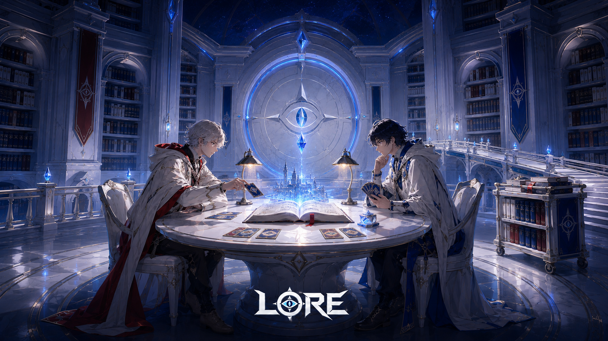

> **注意（2026-09-07）**: 本フォルダは旧世界観（万史大書庫／対読／記録収集家）で生成した記録。用語は廃止済みで、正典は [docs/world-bible.md](../../world-bible.md)。画像は参照資料として保持する。

# LORE — 万史大書庫の対読・統合版

2026-09-06。ユーザーが指定した4枚を統合し、現行ロゴの雰囲気へ寄せた新しいキービジュアル。

- 1枚目: 夜紺の奥行き、青い魔法光、白銀の建築。
- 2枚目: 書庫をつなぐ橋と回覧車。
- 3枚目: 目と環を持つ封印扉。
- 4枚目: 二人がテーブルを挟んで座る対面構図、赤と青の衣装。
- 現行ロゴ: 白銀・黒紺・シアン、シャープな輪郭。

二人の対読を主役にし、カードを出す仕草と手札を加えてデュエルとしての読み取りを強めた。白い素材は維持し、前回より夜紺の陰影を増やした。

内蔵ImageGenで1枚生成。参照とプロンプト全文は [prompt.json](prompt.json)。ロゴも参照入力から生成された描画であり、原本PNGを後合成したものではない。

PNG 1672×941px。目視で対面構図、カードの動作、4参照の主要要素、ロゴの可読性を確認。保存版と生成元のSHA-256一致を確認。既存画像は上書きしていない。

