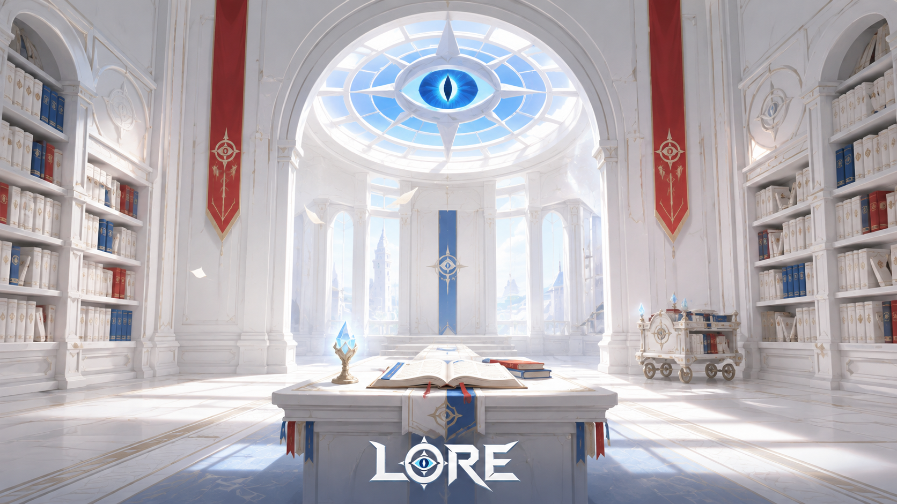
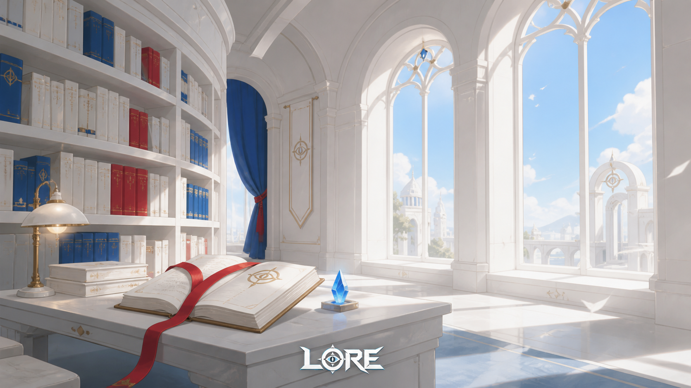
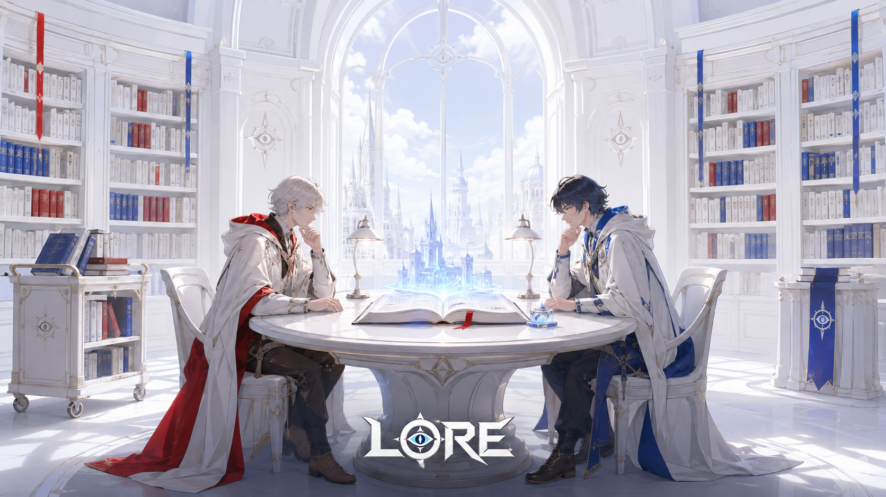
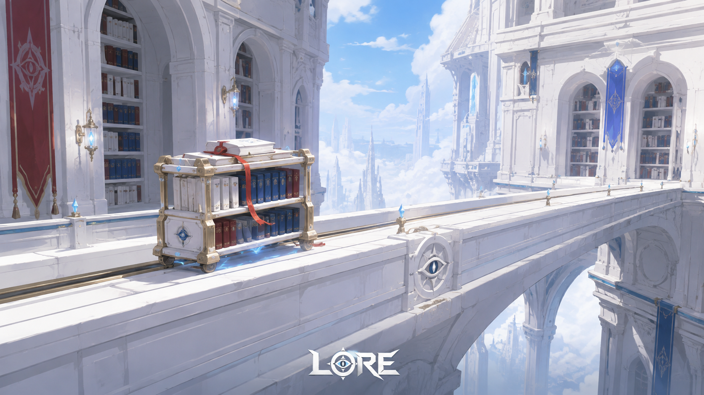
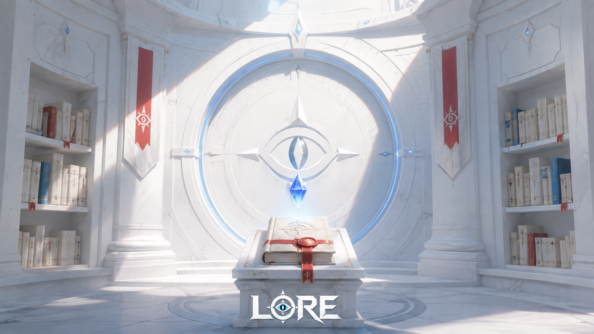

> **注意（2026-09-07）**: 本フォルダは旧世界観（万史大書庫／対読／記録収集家）で生成した記録。用語は廃止済みで、正典は [docs/world-bible.md](../../world-bible.md)。画像は参照資料として保持する。

# LORE — 白い魔道図書館：キービジュアル5案

制作日: 2026-09-06

ユーザー指定に基づくコンセプト探索。白を主色、赤・青をキーカラーとし、原神ライクな明るいアニメファンタジーの空気感と、比較的シンプルな構造・装飾を狙った。既存のカード用ダークファンタジー方針とは別に、今回指定された配色・表現を優先した。

## 参照

- 世界観: `docs/ui-rework-plan-2026-09.md` の世界観出典・オブジェクト辞典。
- 同Docsが出典として指定する `_to_delete/ui-concepts-2026-08-29/2026-08-29/README.md`。
- アート方針・工程: `docs/card-art-direction.md`、`docs/card-art-pipeline.md`、`docs/card-art-codex-workflow.md`。
- 現行ロゴ: `client/public/art/brand/lore-wordmark.png`。現行CSSの参照を確認し、`lore-logo-transparent.png` と同じ目・環・白い文字の意匠であることを目視確認。

## 制作方法

Codex内蔵 ImageGen を1案につき1回、合計5回使用。各回で現行ロゴ画像を参照入力した。ロゴは参照をもとに生成画像に描画されたもので、原本PNGのピクセル一致を保証する後合成は行っていない。全5枚を原寸のPNGで保存。人物・具体的建築形状はこのコンセプト用の提案であり、既存設定の確定追加ではない。

## 成果物

### 1. 白亜の大閲覧堂

青い目の天窓を中心にした、白い万史大書庫の象徴的な大閲覧堂。

### 2. 赤い栞の回廊

白い書架と窓辺の机。赤い栞と青いアチューンで、穏やかな魔法の日常を描く。

### 3. 年代記をひらく対読

赤と青の衣をまとった二人の記録収集家。年代記から歴史が立ち上がる対読の場面。

### 4. 回覧車が渡る書庫

白い書庫棟をつなぐ橋と回覧車。書物が循環する世界を広がりのある構図で描く。

### 5. 第零書庫の白い封印

目と環の封印扉、赤い封蝋の年代記、青いアチューン。明るい白の中に未知の歴史を感じさせる。

## 検証

5枚とも目視で白主体、赤と青のアクセント、書庫の識別性、ロゴの可読性、構図の違いを確認。全画像1672×941px、PNG。原本と保存版のSHA-256一致およびPNG構造を確認。既存アセットやコードは変更していない。

## 使用プロンプト

実際に送信した共通指示と各案の全文を `prompts.json` に保存。各レコードに参照入力の生成元パスと最終ファイル名を記録。

