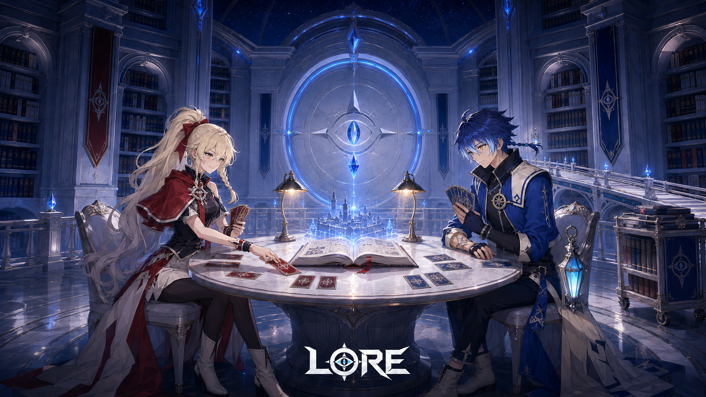
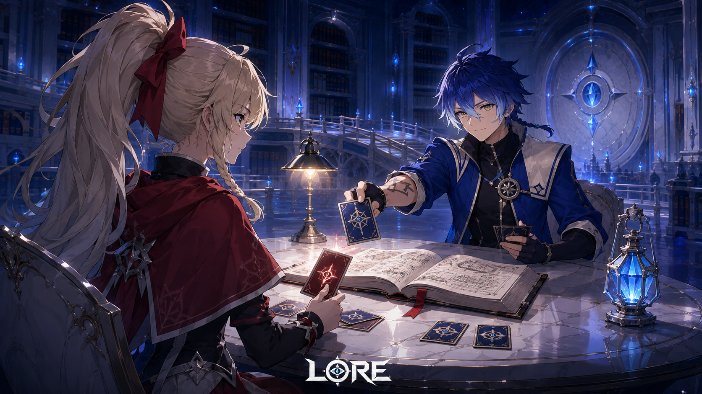
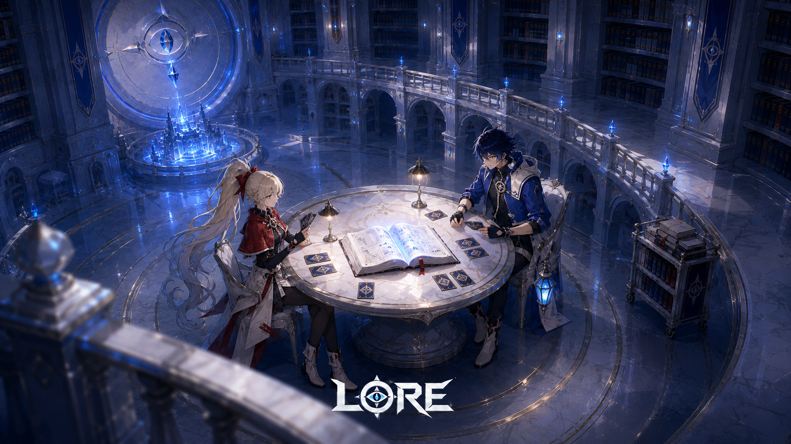
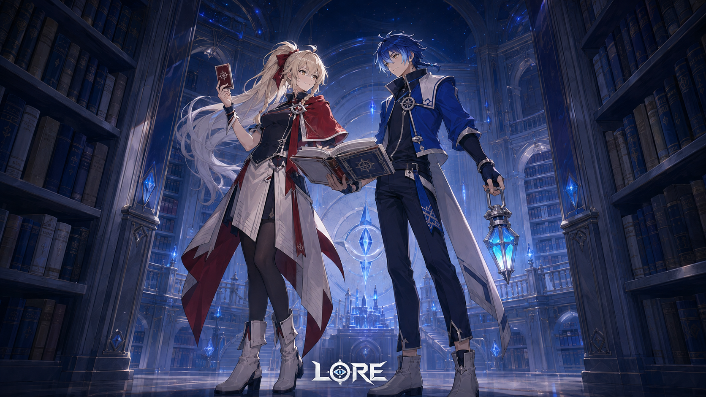

> **注意（2026-09-07）**: 本フォルダは旧世界観（万史大書庫／対読／記録収集家）で生成した記録。用語は廃止済みで、正典は [docs/world-bible.md](../../world-bible.md)。画像は参照資料として保持する。

# LORE — 確定した二人のキービジュアル

2026-09-07。ユーザー確定の赤の女の子・青の男の子を使用。**元構図の改訂KV1枚＋別角度のコンセプト3枚、計4枚**。

[確定キャラクター原画と外見基準](../../characters/README.md)

## 画像

### 改訂KV：赤と青の対読

3枚目の正面構図を引き継ぎ、確定した二人に差し替え。

### 別角度①：彼女の肩越し

女の子の肩越しに、カードを出す青の男の子を見る。

### 別角度②：上階からの対読

上階の回廊から斜めに見下ろし、二人と書庫の広がりを描く。

### 別角度③：書架の間の二人

低い視点から、読書灯を持つ彼と年代記を抱える彼女を描く。

## 制作・検証

- Codex内蔵ImageGenを1枚につき1回、計4回使用。人物原画2枚とユーザー添付の青い対読KVを各回の参照入力に使用。
- 01は元KVの正面構図・書庫の雰囲気を維持した人物の置き換え。02は肩越し、03は上階からの斜め俯瞰、04は書架間の低い視点。04は対読の合間の立ち姿として二人と世界観を見せる。
- [使用プロンプト全文・参照入力・生成元](prompts.json)。[PNG寸法・ハッシュ](manifest.json)。
- 全4枚を原寸PNGとして保存し、生成元とのバイト一致とPNG構造を検証。
- 目視で2人の性別、髪色・髪型、赤い短ケープ／青い短丈ジャケットと読書灯、図書館の青い陰影、構図の違いを確認。生成による細部差はあり、今後のデザイン基準は確定原画を優先する。
- LOREの文字は参照画像から生成した描画。原本ロゴのピクセル一致を保証する後合成は行っていない。
- 既存KVを上書きせず、新しいDocsフォルダに保存。ゲームの本番背景差し替えやアニメーション制作は行っていない。

