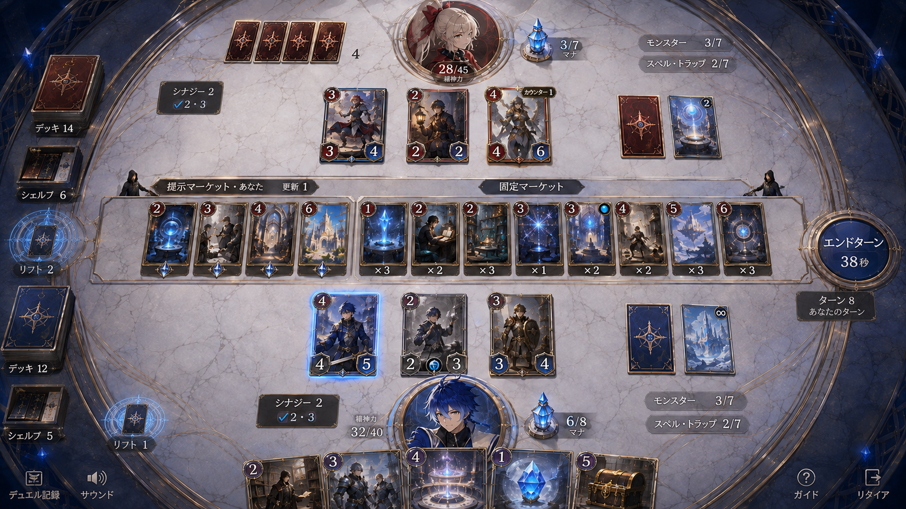
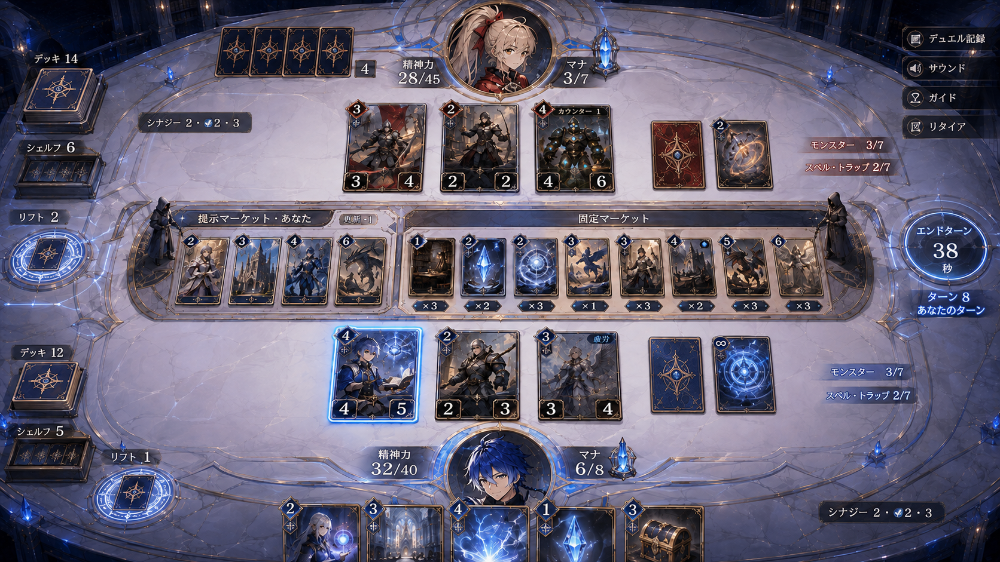
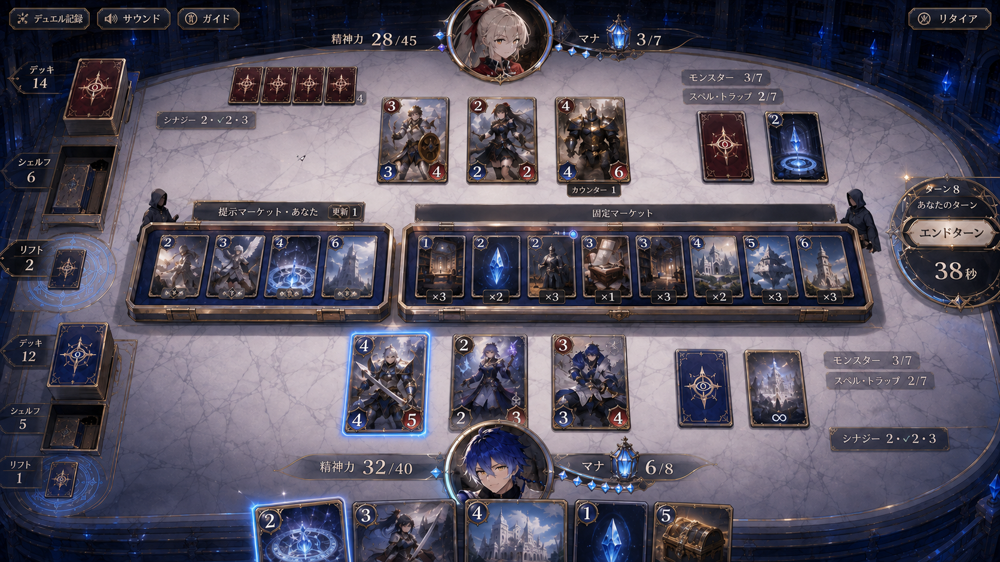
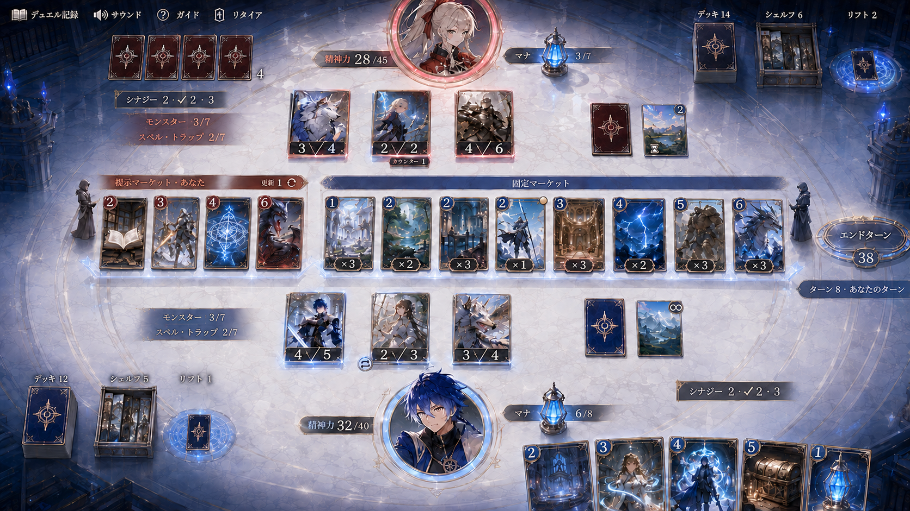
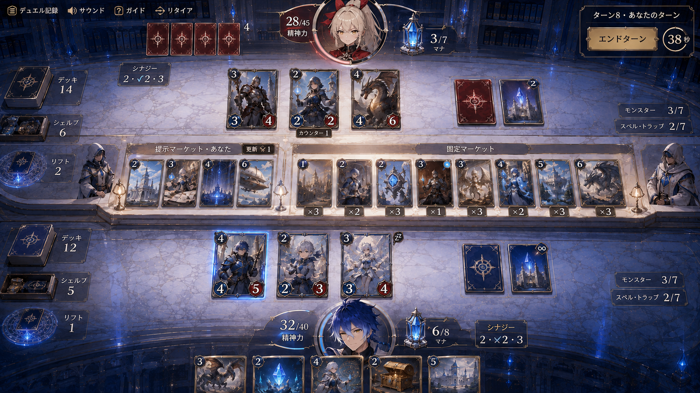

# ビブリオン UI — 5案比較

全案で赤のシーカーは中央上、青のシーカーは中央下、固定8枚・提示4枠は中央。通常画面に出ない機能も含めた[継承仕様](README.md)とセットで確認する。NPCの容姿は仮案。

## 01 白亜のデュエルテーブル

白い円卓を基準にした案。カードと数値を主役にして、石材と接地影で質感を作る。

## 02 アチューンのインレイ

操作部とマナ表示を石面に組み込む案。アチューンの光と卓面の反応で、操作と状態をつなぐ。

## 03 マーケットのカードケース

固定と提示を2つの薄いカードケースでまとめる案。借りるカードを選ぶ行為が最も物理的に見える。

## 04 アチューンのプロジェクション

カードを石面の少し上に投影する案。白い余白と薄い術式で、具現化の軽さを出す。

## 05 NPCのマーケットカウンター

中央カウンターに小さな2人のNPCを置く案。固定と提示の違いを、担当する存在と展示面で分かりやすくする。

