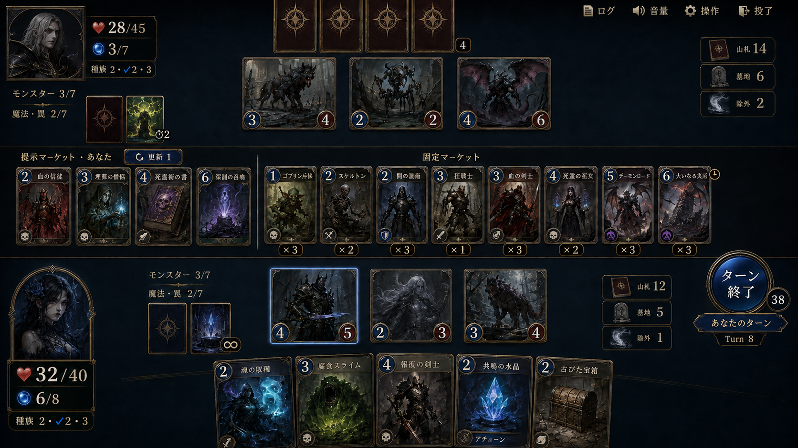
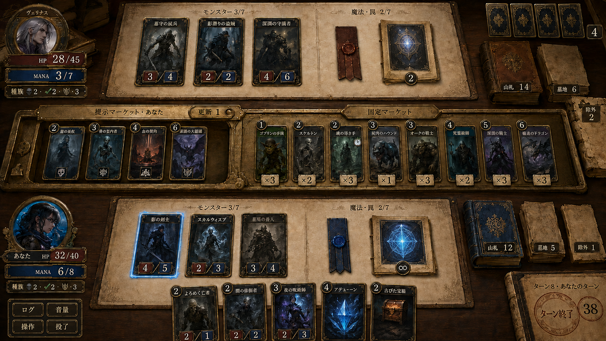
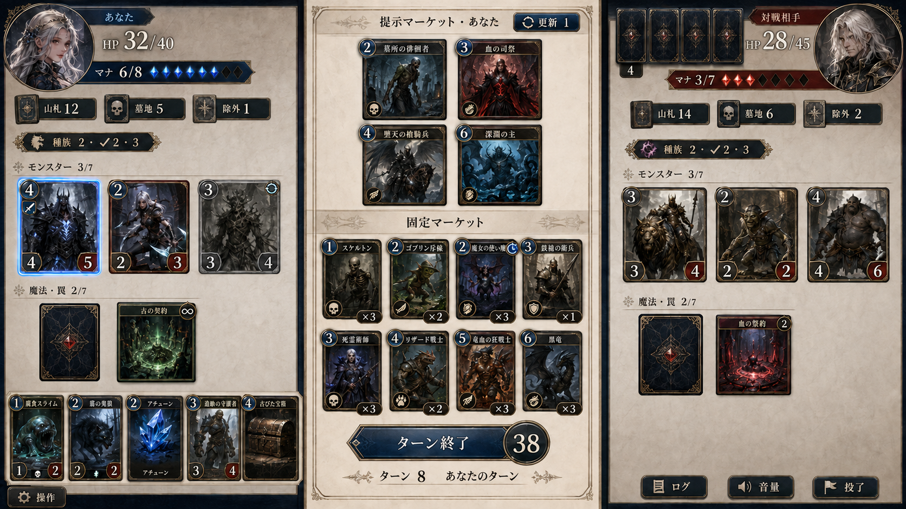
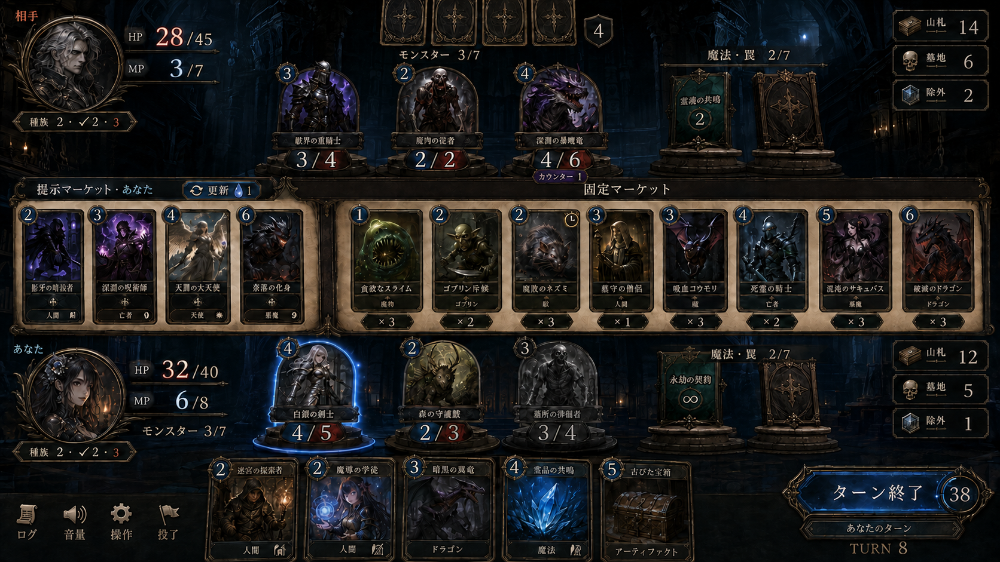
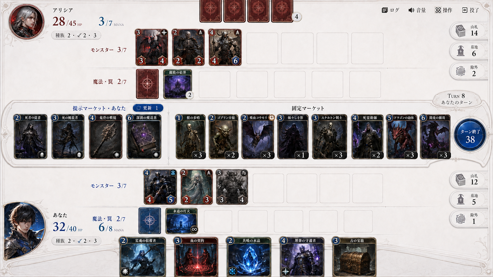

# 5案の比較

各画像は現行機能を継承するための共通仕様とセット。機能・特殊状態の対応は [README](README.md)、生成指示は [prompts.json](prompts.json) を参照。

## 01 競技盤 — 判断の速さ

場・市場・手札を水平に分離。空き枠を消し、大きい数値とカード絵に視線を集める。

## 02 閲覧机 — 触って理解する

山札を本、罠を栞、市場を回覧トレーとして表現。物の質感で豊かさを作り、機能名も併記する。

## 03 中央書架 — 市場を軸に対戦

左右で向き合い、提示と固定市場を中央の縦パネルへ集約。購入候補を一箇所で比較できる。

## 04 召喚舞台 — カードの存在感

モンスターの絵を台座から立ち上げ、盤面の存在感を主役にする。数値と選択領域は小さい台座に固定する。

## 05 白い整理盤 — ルールの見通し

各者7＋7の容量を淡い枠で明示。白い余白にカードと重要数値だけを強く載せる。

