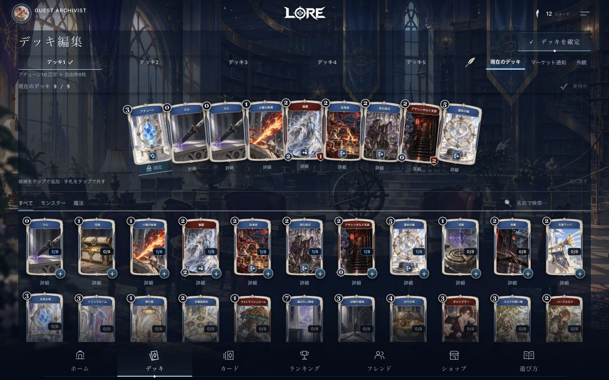
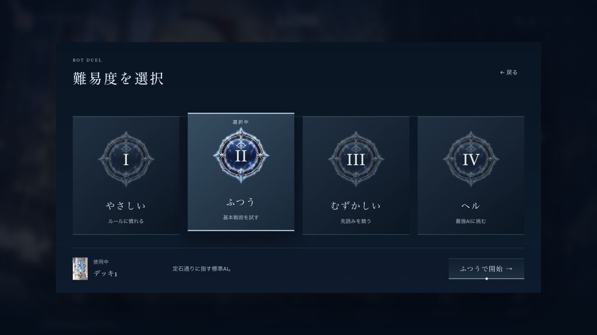
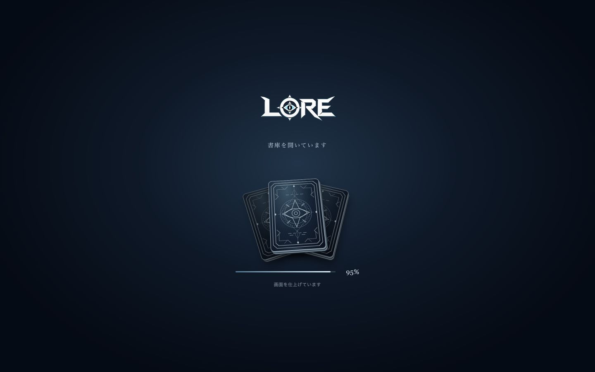

# 採用メニューの統合

2026-10-02。デッキ「手札ファースト・③蒼銀の刻印」、カード「ワイド・コレクション」、BOT「チャレンジカード」。実装は既存カードDOM・フレーム・アートとzoomCardを再利用する。生成した一枚絵への置換は行わない。

## 操作

デッキの左端はアチューン固定。自由枠は8枚。候補をタップして追加、満杯なら交換候補を選んで手札をタップ。通常の手札タップは取り外し、詳細ボタンは共通の拡大表示。Undo、5デッキ切替、名称、使用デッキ、マーケット通知、外観、API保存と失敗時の復帰を維持する。確定は画面右上の薄い水平線。

BOT難易度は選択と開始を分離。既存easy/normal/hard/hellをそのまま渡し、説明文・選択状態を表示する。Escapeと戻るでキャンセルし、フォーカスを戻す。

## 検証

- typecheck/build、menu-selected、deck-hand-editor、biblion-vfxのローカル確認。リリース時にguardが全49ケース、typecheck、buildをコミットスナップショットで再実行する。
- 1440x900・1280x720および390x844で実画面確認。
- ローカルゲストで手札交換・確定・カード一覧から共通詳細表示・BOT hard選択から対戦開始を確認。認証オンライン対戦の確認とは区別する。
- スクリーンショットは実際のVite画面。ステージング版のソース・Worker・配信ハッシュはリリース後に別途記録する。

## 並行作業・ローカル変更

mainの584de3c6（ポートレートカウンター位置修正）を取り込み、その上へ統合。既存ローカル差分のソース、必要なアート、テスト、キャッシュ生成物を別コミット7029e5baに保存。開発用VFXラボは開発入口のまま保持する。NodeのVFXテストはimport.meta.env.DEV=falseを指定して製品環境条件で検証する。

local-integration.jsonのincludedは取り込んだファイルの元SHA-256。preservedLocalはメイン作業フォルダに保全した未採用試作・画像・動画・シミュレーション生ログ等（約10GB）。巨大な生成資料とPythonバイトコードは製品リリースに含めない。旧作業ツリーの採用済みパッチを重複適用せず、新しいmainの修正を維持する。進行中の別テーマの変更は破壊しない。

本番へのデプロイは対象外。
