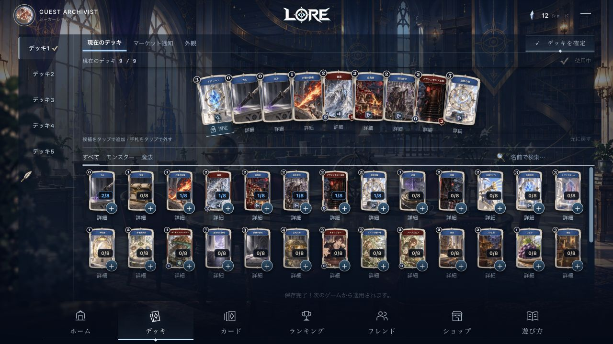
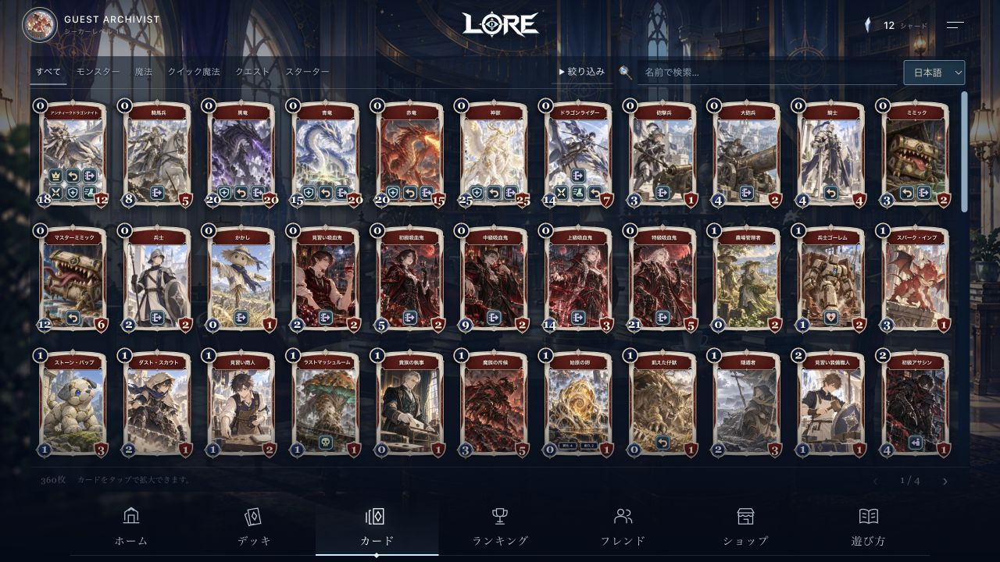
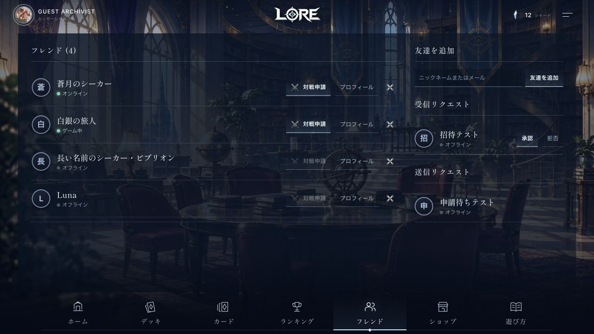

# メニューの空間配分改善

2026-10-02のユーザー指示に対応。既存フレーム・アチューン左端固定・蒼銀の刻印・手札表示・保存操作・共有カード詳細を保持。

- デッキ／カードの大見出しを視覚的に取り除き、画面名はナビと読み上げ用見出しで保持。
- デッキ切替を左の縦バーへ移動。通知／外観／確定を上部1段に集約。
- 手札領域と補助情報を圧縮し、候補の高さにカードサイズを合わせる。PCの手札9枚を維持、スマホは横スクロールの手札。
- カード検索と種別をPCで1段化。1280x720で3段のカードが見える。
- フレンド一覧を主役にし、追加・受信・送信申請をPCで右に配置。スマホでは縦に配置し長い名前と操作ボタンを分離。申請・削除・プロフィール・対戦APIは変更なし。

## 確認

実際のアプリをCUAで操作。候補のタイル（詳細ボタンを含む）の矩形がスクロール領域に収まるかを測定し、1280x720、1024x600、390x844、375x667すべて2段を確認。layout-checks.json参照。1440x900でも2段以上を確認。1280x720の保存完了メッセージ表示中も2段を維持。

左バーのデッキ切替、マーケット通知、外観、ローカルゲスト保存、カード検索（アチューン6件）、絞り込みの表示・Escape閉じを操作確認。フレンドはローカルの読み取り専用API fixtureで4名、オンライン／対戦中／オフライン、受信・送信申請と長い名前を確認。実ユーザーへのフレンド送信は行っていない。

既存deck-hand-editor/menu-selectedと型チェックを通過。リリースガードが全production-suite、型チェック、ビルドを再検証する。ステージング配信の証拠はリリース後の別ファイルへ記録する。

